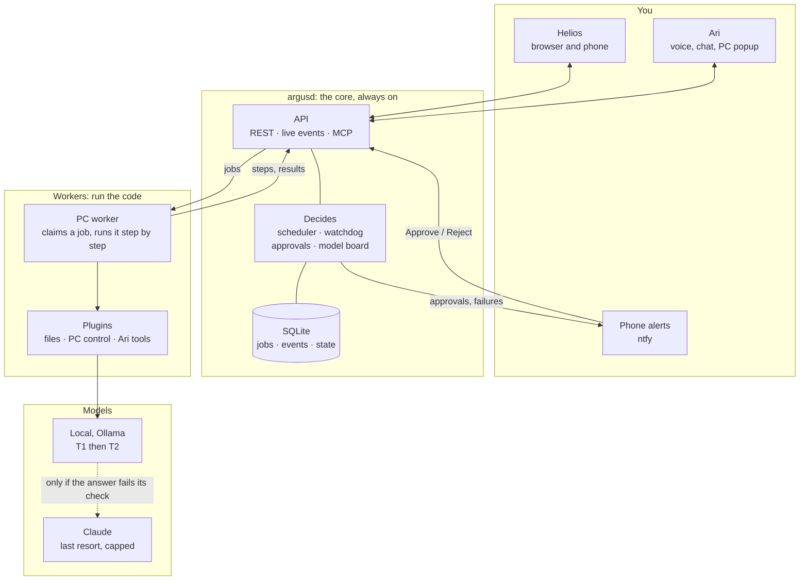
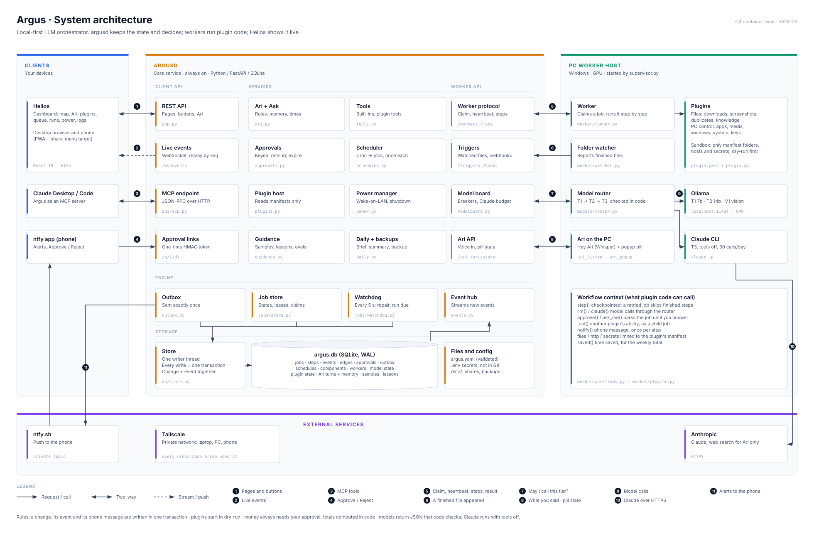
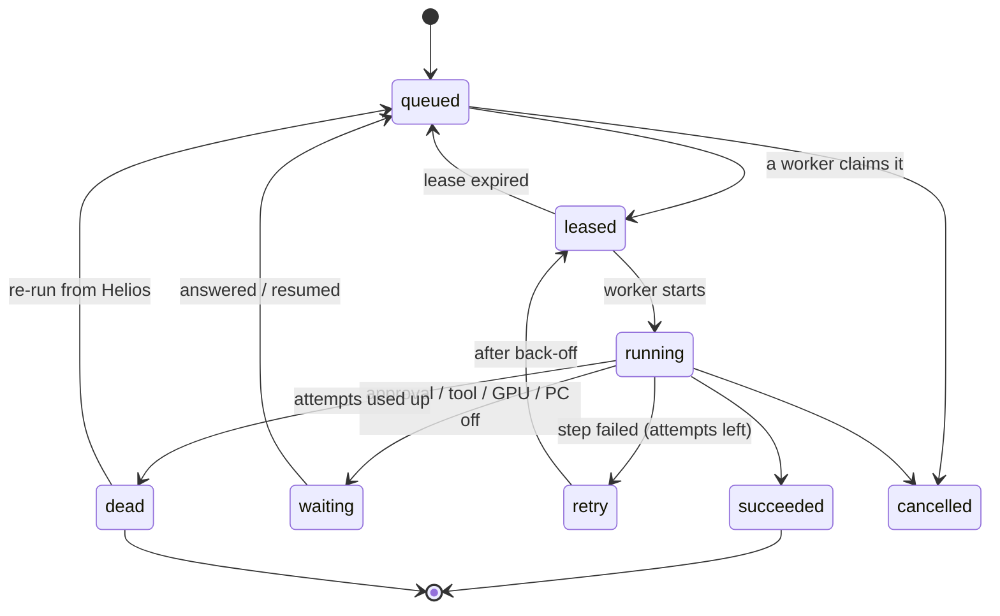

# Argus architecture

Argus is a local-first orchestrator for your own automations. You describe work as **plugins** (a folder with a
manifest and some Python). Argus decides **when** it runs (schedules, watched folders, buttons, Ari), **where** it
runs (a worker on the PC or the laptop), and **which model** answers (a small local one first, bigger ones only
when needed). It asks **you** before anything risky, and shows all of it live in **Helios**, the dashboard.

This page starts with the big picture. Click any ▸ heading to open the details.

---

## The big picture



**In one sentence each:**

- **argusd** keeps the state (one SQLite file), decides what runs next, and never runs plugin code itself.
- **Workers** pull jobs over HTTP, run the plugin's workflow step by step, and report every step back.
- **The event stream** records every change. Helios draws its live map and history from it.
- **You** approve risky things from the phone or Helios. Ari is the conversational way in.

<details>
<summary><b>▸ The detailed diagram (every part, every connection)</b></summary>



**The numbered flows:**

| # | From → to | What travels |
| --- | --- | --- |
| 1 | Helios ↔ REST API | Every page's data and every button (token) |
| 2 | Live events → Helios | The event stream, replayed from the last `seq` after a reconnect |
| 3 | Claude Desktop / Code ↔ MCP endpoint | Read status, press a plugin's button, ask Ari |
| 4 | ntfy app → Approval links | Approve / Reject with a one-time HMAC token |
| 5 | Worker ↔ Worker protocol | Register, claim, heartbeat, steps, result |
| 6 | Folder watcher → Triggers | "A finished file appeared" (path + sha256) |
| 7 | Model router ↔ Model board | "May I call this tier?" (breakers, Claude budget) |
| 8 | Ari on the PC ↔ Ari API | What you said after "Hey Ari"; the pill's state for the popup |
| 9 | Model router → Ollama / Claude CLI | The model calls (T1 → T2 → T3) |
| 10 | Claude CLI → Anthropic | Claude over HTTPS (tools off; web search only for Ari) |
| 11 | Outbox → ntfy.sh → phone | Approvals, failures, brief, summary, sent exactly once |

Inside argusd, the engine's writes (outbox, job store, watchdog) all go through the one Store writer into
`argus.db`; the event hub reads new rows from it and streams them out (flow 2).

</details>

<details>
<summary><b>▸ The life of one job, start to finish (read this first)</b></summary>

Take "a PDF lands in Downloads" as the example.

1. **Trigger.** The PC worker's folder watcher sees the file. It waits until the size stops changing, hashes it,
   and reports it to argusd (`POST /triggers/file`). argusd remembers files by content, so the same PDF downloaded
   twice is only handled once.
2. **Queued.** argusd writes a `jobs` row (`downloads-organizer.file`, state `queued`) and a `job.queued` event,
   in **one transaction**.
3. **Claimed.** The worker asks for work (`POST /workers/pc/claim`). argusd picks the best job it can run
   (priority first, then the model already loaded, then age) and gives it a **lease** of 60 s. State: `leased`.
4. **Running.** The worker starts the workflow and a heartbeat thread renews the lease every 15 s. Each
   `ctx.step("name", fn)` reports `running`, then `succeeded` with its output. **A finished step is a checkpoint.**
5. **Model call.** A step calls `ctx.llm(...)`. The router asks T1 (qwen2.5-coder:7b) and checks the answer in
   code. If it fails the check, T1 gets another try with the reason. If it still fails, the question goes to T2
   with T1's attempt as advice. Each hop is an event, so the map shows `plugin → T1 → T2`.
6. **Approval (if needed).** `ctx.approve(...)` writes an approval and an ntfy message together. The job moves
   to `waiting` and the worker is **free** for other work. You tap Approve. The job returns to the queue ahead of
   scheduled work, the step runs again, and `ctx.approve` now returns your answer.
7. **Done.** The worker posts the result. State `succeeded`, event `job.succeeded`. Helios updates within
   milliseconds.

**If the PC crashes during step 4:** the heartbeats stop, the lease expires, and the watchdog requeues the job.
The next attempt skips every finished step, because `ctx.step` returns the saved output.

</details>

---

## Where things live

| Folder | What it is |
| --- | --- |
| `core/argus/` | argusd, the worker, the model router, Ari: all the Python |
| `core/argus/api/` | The HTTP API (`app.py`), the MCP server (`mcp.py`), the approval page for the phone |
| `core/argus/jobs/` | The job state machine, the job store (every job operation), the watchdog |
| `core/argus/db/` | The SQLite store and numbered migrations (`0001`…`0012`) |
| `core/argus/models/` | Model providers (Ollama, Claude CLI), the tier router, `doctor` |
| `core/argus/worker/` | The worker loop, workflow `ctx`, built-in workflows (Ari think, review, power, health…) |
| `core/argus/helios_dist/` | The built Helios, served by argusd at `/helios` |
| `helios/` | Helios source (React 19 + Vite + xyflow + elkjs) |
| `plugins/` | Your plugins, one folder each (`plugin.yaml` + `plugin.py`) |
| `tests/` | pytest (about 360 tests), with a fake Ollama and no real Claude calls |
| `scripts/` | `dev.ps1` (up, down, logs, pr, merge), `release.py`, the PC worker installer |
| `deploy/` | The laptop kit (Linux, systemd, compose) for the move off the PC |
| `docs/` | Design docs, the roadmap, this page |

---

## The core, part by part

<details>
<summary><b>▸ argusd: startup and the background tasks</b></summary>

`argusd` (`daemon.py`) loads `argus.yaml` and `.env`, validates them (a bad config stops it with a clear
message, exit code 2), opens the database (exit 3 on trouble), then `context.py` starts everything in this order:

1. The `argus` box on the map, the model tiers, the approvals service.
2. **Crash check.** A marker file tells whether the last run ended cleanly. If not (a power cut), you get one
   phone message about what happens now (`argus.resumed`).
3. **Plugins.** `plugin_host.load()` reads every manifest and adds its schedules, folder watches and webhooks.
   Your settings from Helios are applied on top of `argus.yaml`.
4. The scheduler syncs its clocks, then the power manager, outbox sender, ntfy relay, phone presence, event hub
   and watchdog start.

**Background tasks (all in one asyncio process).** Most of the housekeeping rides on one **watchdog tick**
(every 5 s). Each part checks whether it has something to do:

| On the watchdog tick | Does |
| --- | --- |
| Leases | Requeue jobs whose worker stopped heartbeating |
| Workers | Mark workers offline after 4 missed heartbeats |
| Scheduler | Queue due schedules |
| Approvals | Reminders and expiry |
| Power | Decide wake / shut down (simulated while developing) |
| Daily | Morning brief (07:00), evening summary, nightly guidance review |
| Backups | Nightly backup at `backup.at`, checked by restoring it |
| Events | Prune events older than the retention |

Alongside it run the **event hub** (woken on every commit), the **outbox sender**, the **ntfy relay** and **phone
presence** (re-sends waiting approvals when the phone is back on Tailscale).

`supervisor.py` (started by `dev.ps1 up`) keeps argusd, the worker, `ari_listen` and `ari_popup` running,
restarts crashed ones with back-off, and restarts everything when the checked-out code changes.

</details>

<details>
<summary><b>▸ The store: one SQLite file, one writer</b></summary>

Everything Argus knows is in `data/argus.db` (`db/store.py`):

- **WAL mode**, so reads never wait for writes.
- **Exactly one writer thread.** Every write is a Python function run inside a transaction on that thread
  (`await store.write(fn)`). Two parts of Argus can never collide, so "database is locked" cannot happen.
- **Group commit.** Writes that arrive together are committed together. Each runs in its own SAVEPOINT, so one
  failing write never undoes the others.
- **Migrations** in `db/migrations/NNNN_*.sql` are applied at open. A database newer than the code is refused.

**The rule that makes everything else simple:** a change and its event are written in the **same transaction**.
A job moving to `dead` writes the job row, the `job.dead` event and the phone message together. After a crash
there is never a state change without its event, or an approval without its notification.

**Main tables:**

- **Work:** `jobs`, `steps`, `approvals`, `outbox`, `schedules`
- **The map:** `components`, `workers`, `edges`, `events`
- **Models:** `model_state`, `budget`
- **Plugins:** `plugin_state` (settings, state), `files_seen`
- **Ari:** `ari_turns`, `ari_memory` (+ full-text index)
- **Learning:** `playbooks`, `samples`, `lessons`
- **Other:** `time_saved`, `held_notes`

</details>

<details>
<summary><b>▸ Jobs: states, leases, claiming, retries</b></summary>

`jobs/states.py` is the only place that says how a job may move. `jobs/store.py` is the only code that moves one.



**Leases and heartbeats.** A claimed job belongs to one worker for `lease_seconds` (60). The worker renews it
every `heartbeat_seconds` (15). Only the lease holder may report steps or results. If the lease is lost (the
worker froze, the network dropped), the watchdog puts the job back in the queue, and the old worker stops at its
next step boundary without reporting anything else.

**Choosing the next job (claim).** Among jobs that are `queued` or `retry` and due:

1. **Priority:** interactive 90 (you asked), resumed 80, scheduled 50, batch 20.
2. Within a priority: **jobs for the model already loaded in Ollama first** (no model swap), then by model, then
   oldest.
3. Skipped if the worker lacks a needed **capability** (`desktop`, `gpu`, `session`, `fs`), if that plugin
   already has `plugin_concurrency` jobs running, if a **GPU job** is already running (one at a time), or if the
   job has a **run window** (the night window) that is closed now.

**Retries.** A failing step moves the job to `retry` with back-off (10 s, 60 s, 10 min). After `max_attempts`
(3) it is `dead`, and your phone hears about it at once. A `PermanentError` skips the retries.

**Checkpoints.** Each finished step's output is stored. A retried job gets its finished steps back and `ctx.step`
returns them without running the function again. For side effects outside Argus, a step has
`ctx.idempotency_key` (`<job>:<step>`).

**Backpressure.** Each plugin has a queue limit (100). Past it, new jobs are refused, and a flood of downloaded
files cannot bury everything else.

</details>

<details>
<summary><b>▸ Events, the live map and Helios's stream</b></summary>

Every change calls `insert_event(conn, now, kind, src=..., dst=..., job_id=..., data=...)` inside its
transaction. Event kinds are dotted: `job.queued`, `step.running`, `model.escalated`, `approval.requested`,
`worker.online`, `ari.state`, and so on.

**The map grows by itself.** Each event can name a sender and a receiver (`argus → downloads-organizer`,
`downloads-organizer → T1`). The first time two components talk, a row goes into `edges` and an `edge.added`
event is written. Helios draws a line, and it gets thicker with traffic. Boxes come from `components`, which argusd
fills from the plugin manifests, the model tiers, workers that register and apps that use a token.

**Streaming without losing anything.** Each event has a `seq` (the SQLite rowid) that only goes up, in commit
order. The `EventHub` is woken after each commit, reads the new rows and hands them to subscribers:

- `GET /ws/events?since=<seq>` first **replays** everything after `since` from the database, then streams live.
- A subscriber that falls behind is **dropped**. It reconnects with its last `seq` and replays the gap. One slow
  browser can never slow Argus down.
- `argus-events` (`tail.py`) is the same stream in a terminal.
- `console.py` (`python -m argus.console`) is the laptop's live terminal: one window split in four (the Argus logo
  with an eye that follows Ari and the machines, jobs and models; Ari's conversation; events; logs). It only reads
  through argusd's API. `deploy/linux/console-setup.sh` opens it by itself when Hyprland starts.

Events are kept for `events.retention_days` (90).

</details>

<details>
<summary><b>▸ Workers and the workflow <code>ctx</code></b></summary>

A worker (`worker/runner.py`) is a small process that can run anywhere it can reach argusd over HTTP. It talks
to argusd with the standard library only.

```
register (id, host, capabilities, plugins)
loop:
    claim (long-polls up to 10 s for work)
    start, heartbeat thread
    run the workflow  ──  each ctx.step reports running / succeeded / failed
    succeed | fail | wait
```

Ctrl+C when idle exits now. During a job it finishes the job first. A second Ctrl+C exits now, and the job is
retried later.

**The `ctx` a workflow gets** (`worker/workflows.py`):

| Call | What it does |
| --- | --- |
| `ctx.step(name, fn, ...)` | Run a checkpointed step |
| `ctx.llm(playbook, input, schema=, check=)` | Ask the model tiers (below); the answer is validated |
| `ctx.claude(prompt, ..., web=, images=)` | Ask Claude directly (counts against the daily cap) |
| `ctx.approve(type, title, fields, items=)` | Ask you; parks the job until you answer |
| `ctx.ask_me(...)` | A question card for you (same mechanism) |
| `ctx.notify(title, text)` | A phone message, once per step even if retried |
| `ctx.tool(name, args)` | Use a tool (another plugin's ability); waits for its child job |
| `ctx.files`, `ctx.http`, `ctx.secrets` | Limited to the manifest's permissions |
| `ctx.embed(texts)` | Embeddings (nomic-embed-text) |
| `ctx.saved(seconds)` | "This job saved you N minutes", for the weekly total |
| `ctx.wait(reason)` | Park the job (for example, until the PC is on) |

**Capabilities** say what a machine can do: `desktop` (a Windows desktop), `gpu`, `session` (a logged-in user
session, needed to open apps and type) and `fs`. Jobs list what they need, and only matching workers claim
them.

</details>

<details>
<summary><b>▸ Plugins: manifest, permissions, dry-run</b></summary>

A plugin is a folder: `plugin.yaml` (what it is and what it may do) plus `plugin.py` (the workflows).

```yaml
id: downloads-organizer
runs_on: desktop
triggers:
  - folder_watch: {workflow: file, paths: ["~/Downloads"], stable_for: 2m}
  - schedule: {workflow: sort, cron: "30 3 * * *"}
  - manual: {workflow: sort, label: Sort Downloads now}      # a button in Helios
permissions:
  files: {read: ["~/Downloads"], write: ["~/Downloads"], delete: none}
  models: [T1]                                               # starts at T1, escalates only on failure
config:  {min_age_seconds: {type: int, default: 120, label: ...}}   # editable in Helios
share:   [{workflow: take, label: Save to PC, accepts: [file, url, text]}]   # phone share menu
ari:     {tools: [...]}                                     # abilities Ari may use
helios:  {node: {label: Downloads, group: files}, rules: {file: rules.yaml}}
```

**Two hosts, two jobs:**

- **argusd side** (`plugins.py`) only **reads manifests**. It puts the plugin on the map, turns triggers into
  schedules, watches and webhooks, and tells workers which plugins exist. It never imports plugin code.
- **Worker side** (`worker/plugins.py`) imports `plugin.py` and gives each job a `ctx` **checked on every call**:
  - Files only inside the manifest's folders and `paths.allowed`, never inside `paths.blocked` (office data is
    blocked). Paths are resolved first, so `..` and links can't escape.
  - No permanent deletes; there is only `recycle()`.
  - Moves never overwrite.
  - Every file change is an event, and each can be undone from Helios.
  - Network only to the manifest's hosts; secrets only by the names it lists.

**Dry-run first.** A new plugin runs, logs and shows what it **would** do, and changes nothing until it is live
(`plugins.live` in `argus.yaml`, or the Live switch on its Helios page). Settings from Helios are stored in
`plugin_state` and applied on top of the manifest defaults.

**Plugins today:**

- **Files:** downloads-organizer, screenshot-renamer, duplicate-finder, knowledge (your files, indexed for Ari).
- **PC control (each a separate plugin):** pc-apps, pc-media, pc-windows, pc-system, pc-keys, and **workstation**
  (Ari's Workstation: Ari's own virtual desktop where it opens what it works on, and hands windows to you).

</details>

<details>
<summary><b>▸ Models: tiers, checks, escalation, the model board</b></summary>

| Tier | Model | Used for |
| --- | --- | --- |
| T1 | qwen2.5-coder:7b (Ollama, GPU) | First try for everything local |
| T2 | qwen2.5-coder:14b | When T1's answer fails its check |
| V1 | qwen2.5vl | Images |
| T3 | Claude (`claude -p`, every tool removed) | Last resort; daily cap (30 calls) |

**The router** (`models/router.py`), for each tier in the chain:

1. Ask the **model board** for a permit. If the tier's breaker is open or the Claude budget is gone, skip the
   tier.
2. Call the model (Ollama: temperature 0, JSON-schema output, kept loaded). A timeout or error counts against the
   breaker and moves on.
3. Parse, validate against the schema, run the plugin's `check` **in code**. Valid: done.
4. Invalid: try again on the same tier and tell the model what was wrong. Still invalid: **escalate**. The next
   tier sees the input plus the lower tier's answer and why it was rejected.

**The model board** (`modelboard.py`, in argusd, shared by all workers):

- **Circuit breaker per tier.** After N failures in a row the tier opens for a while, then lets one trial call
  through. A wrong answer is not a failure; a dead model is.
- **Claude budget.** Every Claude call reserves one of `claude.calls_per_day` first.

**Claude is locked down.** It runs through the CLI in print mode with tools off (text in, text out). Ari's web
answers are the one exception: `WebSearch` and `WebFetch` only, read-only.

</details>

<details>
<summary><b>▸ Approvals, the outbox and your phone</b></summary>

`approvals.py`:

- **Asking twice is safe.** Each approval has a key (`<job>:<step>:<n>`). A retried step gets the same approval
  back, and the phone hears once.
- **The job waits, the worker doesn't.** The job is `waiting`, and the worker takes other work.
- **One-time signed buttons.** The ntfy message's Approve / Reject buttons carry `HMAC(install key, approval id)`,
  valid only while the approval is pending. By default they call Argus over Tailscale. If the phone is off
  Tailscale, `presence.py` re-sends when it's back. With `approvals.buttons: ntfy` they go through a private reply
  topic that `relay.py` listens to.
- **Money is computed in code.** A batch's count and total are added up with `Decimal`, never taken from a model,
  and money always needs your yes.
- **Waiting isn't failing.** One reminder after `remind_hours`. After `expire_hours` the approval counts as "no".

**The outbox** (`outbox.py`) is how anything leaves Argus. A message is a row written in the same transaction as
its cause, sent by one sender with retries and a `dedupe_key`. It is never lost and never sent twice. **Quiet by
default:** only approvals and failures reach the phone at once. The rest waits for the evening summary.

</details>

<details>
<summary><b>▸ Scheduler, triggers and power</b></summary>

- **Scheduler** (`scheduler.py`, `cron.py`). Schedules come from `argus.yaml`, plugin manifests and Ari ("every
  morning at 7"). The `schedules` table keeps only their clock. On each watchdog tick, due ones are queued, each in
  one transaction with its clock update: never twice, never skipped. If Argus was down, it runs **once** on return
  (not once per missed slot). A run still going when the next is due is merged.
- **Triggers** (`triggers.py`):
  - **Folder watches** run inside the worker that has the folder. Files are remembered by content, so copies and
    restarts don't re-run.
  - **Webhooks** arrive at `/hooks/{name}`.
  - **Buttons** in Helios.
  - **Share menu:** the phone shares into a plugin (`shares.py`).
- **Power** (`power.py`). The PC is woken (Wake-on-LAN) when GPU or desktop work is queued, and shut down after a
  quiet period. While developing on the PC it is **simulated**: it logs `power.would_shutdown` so the rules can be
  watched before they ever switch anything off.

</details>

<details>
<summary><b>▸ Ari: the assistant</b></summary>

You talk to Ari from Helios (typing or the mic), the phone, or "Hey Ari" on the PC. A message goes through, in
order (`ari.py`, then `worker/think.py`):

1. **A pending question?** "yes" / "no" answers it.
2. **"remember that…"** → `ari_memory` (full-text searchable). "forget…" removes a memory.
3. **A time** ("every morning at 7 sort downloads", "remind me in 20 minutes") → a proposed schedule. It is made
   only after your yes.
4. **Instant rules** ("what's running", "sort downloads") → answered at once from Argus's data.
5. **Anything else** → job `ari.think` on a worker: an **agent loop** of up to 6 steps. Each step, the local model
   picks **one** tool (or answers). Tools are Argus's own (status, jobs, schedules, memory…) and plugin abilities
   (open app, volume, search my files…). A plugin tool runs as a **child job** of that plugin, with its
   permissions, and the think job waits for it. Tools marked "asks first" (closing apps, typing) are not run: Ari
   asks, and your yes runs them.
6. **Needs current information** (news, weather) → Claude with web search, read-only, within the daily cap.

**Local first:** questions about your own things always go through a tool (your files via `knowledge`, Argus's
data). General knowledge is answered by the local model when it's sure.

**Voice:**

- **Hearing:** the browser's speech recognition, or Whisper on the PC (private).
- **Speaking:** one voice: Chatterbox on the PC's GPU (`voice_server.py`). If it can't speak, Ari shows the words
  and stays silent; there is no second voice.
- **`ari_listen.py`:** "Hey Ari" on the PC mic with no browser. Tiny Whisper listens for the wake phrase;
  nothing leaves the PC.

**The Ari pill.** Ari reports what it's doing as `ari.state` events (listening, thinking, working with the tool
name, speaking, done). Helios shows a pill at the top (pulse or comet look), and `ari_popup.py` shows the same pill
over the whole PC screen. Both follow the event stream, so a question typed on the phone lights up the PC.

</details>

<details>
<summary><b>▸ The guidance loop: local models learn from their mistakes</b></summary>

`guidance.py` + `worker/review.py` + `worker/followup.py`:

1. **Samples.** Every `ctx.llm` answer is kept per playbook: the input, the answer, which tier answered, whether
   T1 was rejected, the lessons in force, and what it was about (`subject=`, a file).
2. **Verdicts.** In Helios (a job's "Model answers") you mark answers Correct or Wrong, with the right answer if
   you like. **Your fixes count without a click:** Undo or Wrong on a job's change, a file you moved back,
   renamed again or moved elsewhere (a worker looks every `guidance.followup_hours`), "no, I meant …" to Ari.
3. **Experience memory.** Answers you confirmed, fixed, or left alone for a day are worked examples; each call
   gets the 2–3 most similar. Examples that keep leading to wrong answers are dropped.
4. **Nightly review.** Claude reads a playbook's mistakes and writes 1–6 short **lessons**. It tries up to
   `guidance.candidates` sets: each next set fixes the tests the best so far still fails (the GEPA idea).
5. **Evals.** Your "correct" answers are replayed on T1 with the old lessons and with the new ones. Before and
   after scores go with the proposal.
6. **You decide.** An approved lesson is appended to that plugin's playbook from the next job on.
7. **Proof.** A job's answers show "lessons used"; the Learning tab has a weekly "first model right" chart with
   lesson approvals marked, and a "with / without lessons" test button.

The effect: T1 gets right what used to need T2 or Claude, so it gets faster and cheaper over time.

</details>

<details>
<summary><b>▸ Things Argus does by itself</b></summary>

- **Morning brief** (07:00): overnight results, what waits for you, today's schedules, the backup, the PC's
  health, yesterday's Claude calls.
- **Evening summary:** everything that didn't need you at once (quiet by default).
- **Backups** (nightly): SQLite's online backup, **proven by restoring it** (integrity check + counts). The newest
  N are kept, and a copy goes to the other machine.
- **Health** (PC worker, every 30 min): WSL and Docker containers. You hear about changes only.
- **Time saved:** plugins report what each job saved you, shown as a weekly total.

</details>

<details>
<summary><b>▸ Helios: the dashboard</b></summary>

React 19 + Vite, built into `core/argus/helios_dist/` and served at `/helios`. One page, one WebSocket.

- **`live.ts`** loads `/map` and `/status`, then keeps them current from the event stream (with replay on
  reconnect).
- **Pages:** Map, Ari, Plugins (each with its own controls, settings, runs and learning), Queue, Runs, Share,
  Power, Logs, Rules.
- **Map:** xyflow + ELK layout. It shows the main parts only (all plugins are one box). Lines pulse for each
  message. The inspector slides in on the right, and events are a `tail -f` dock at the bottom.
- **Phone** (≤ 720 px): a simple home (needs you, now, next, saved), the Share menu target, and the map as its
  own sideways full-screen page.
- **`popup.html`:** just the Ari pill, for the PC popup window.
- **The look:** a modern terminal. Near-black, hairlines, Geist Mono for labels and numbers, amber for
  attention, cyan for flow, green for ok. Motion respects "reduce motion".

</details>

<details>
<summary><b>▸ MCP: Claude as a client of Argus</b></summary>

`POST /mcp` (`api/mcp.py`) speaks MCP (JSON-RPC over HTTP) with the same token as Helios. Claude Desktop or
Claude Code can:

- **Read:** status, queue, jobs, logs, waiting approvals, schedules, time saved.
- **Act:** press a plugin's button, ask Ari.

It deliberately **can't** approve, change settings, power the PC off or touch files.

</details>

<details>
<summary><b>▸ Security, kept lean on purpose</b></summary>

Single user, home network. The rules:

- **Network:** Tailscale only; nothing is exposed to the internet.
- **API:** a token for everything (`ARGUS_WORKER_TOKEN` in `.env`; `.env` is never in Git). Phone buttons use
  one-time signed tokens.
- **Models:** they can't act. They return JSON that code checks. Claude runs with tools off, except read-only web
  search for Ari.
- **Plugins:**
  - Plugins see only their manifest's folders, hosts and secrets. Office (DirectFN) data is blocked for every
    plugin.
  - There are no permanent deletes; everything goes to the Recycle Bin.
  - Every file change can be undone.
- **Money:** always approved, with totals computed in code.
- **Skipped for now:** passkeys/TOTP, a plugin sandbox, disk encryption. The data is on your own machine, behind
  Tailscale.

</details>

---

## Where to read next

| If you want to… | Read |
| --- | --- |
| Write a plugin | [plugin-guide.md](plugin-guide.md) |
| Set it up on a PC | [setup.md](setup.md) |
| See every design decision | [core-design.md](core-design.md), [orchestrator-plan.md](orchestrator-plan.md) |
| Know what's next | [roadmap.md](roadmap.md) |
| Read the code for one part | the file named in that section above; each starts with a docstring explaining it |
